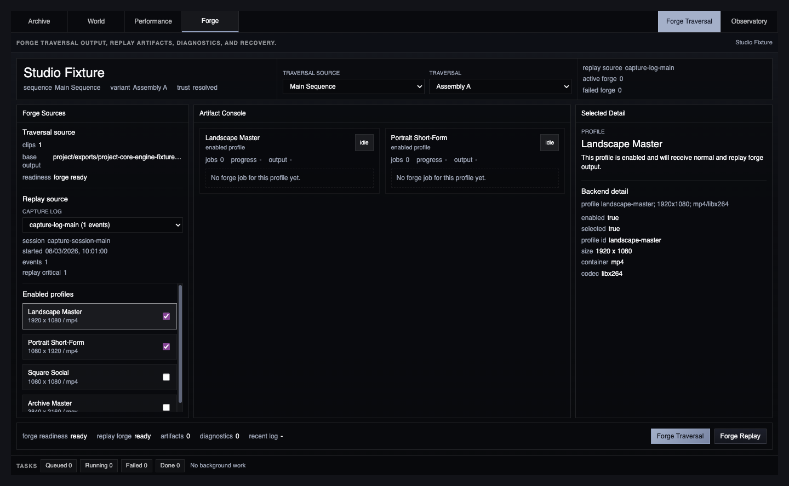
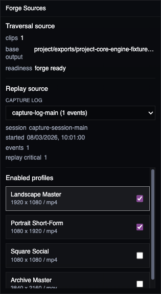
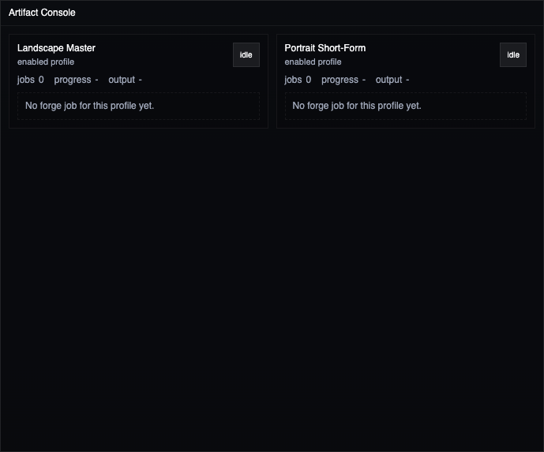
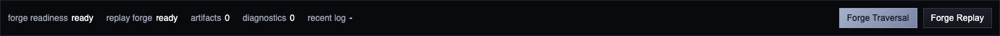

# Forge Space

Forge Space is the Studio output room. Use it when an authored traversal or replayed capture log should become reviewable artifacts.

Forge does not record new live input and does not own preview rehearsal. Capture sessions and capture logs remain source-data terms for replay inputs. Forge uses the existing export job contract, export profiles, render artifacts, render diagnostics, retry/cancel actions, and project profile state.

## Choose The Traversal

The header resolves the active composition, sequence, and variant through the same composition resolver used by World and Performance. If the resolver falls back to project defaults, Forge reports the trust state so the output set can be reviewed before rendering.

Use **Traversal source** for the sequence and **Traversal** for the variant. Forge builds the base output path from that variant and the current project root.

## Choose Replay Source Data

The replay selector lists existing capture logs. Forge selects the latest capture session and matching log by default, but another capture log can be chosen when replaying a different performance.

Replay readiness requires a selected capture log with events. Empty or missing logs block **Forge Replay** while normal **Forge Traversal** can still be ready.

## Review Profile Lanes

The artifact console groups export jobs by profile. Each lane reports whether the profile is enabled, idle, queued, running, failed, completed, or cancelled.

Completed jobs expose final output paths and render artifacts. Artifacts marked final are review outputs. Intermediate artifacts remain visible so render issues can be traced back to cache keys, render passes, and provenance.

## Inspect Detail

The detail panel explains the selected profile, capture log, job, artifact, capture event, or render diagnostic in creator-facing language first. Backend identifiers, paths, cache keys, and graph references follow below it.

This keeps semantic review and operational debugging in the same place without changing public project schemas or job result shapes.

## Recover Output

The bottom strip shows forge readiness, replay forge readiness, artifact counts, render diagnostics, recent logs, warnings, missing media, and active or failed jobs.

Use **Retry Failed** or lane-level **Retry** for failed export jobs. Use **Cancel Active** or lane-level **Cancel** for queued/running jobs. The primary action is **Forge Traversal**. Use **Forge Replay** when the selected capture log should drive output.

