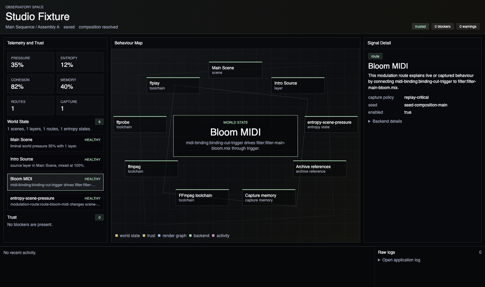
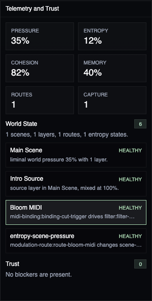
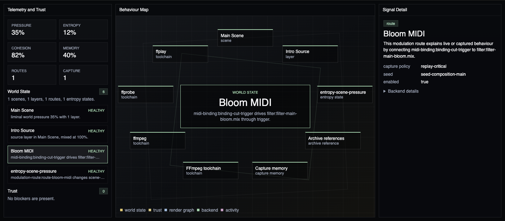

# Observatory Space

Observatory Space is the Studio explanation room. Use it when a world is not behaving as expected, when render output cannot be trusted, or when you need to understand which existing project facts are shaping the current composition.

It does not add a new project schema, render contract, capture mode, or diagnostics service. It derives its view from the active composition, sequence, variant, project integrity checks, desktop diagnostics, preview/export job results, render graph diagnostics, capture logs, and application logs.

## Read The Active World

The header names the active composition and shows the sequence/variant pair resolved by the same composition resolver used by the rest of Studio. The trust pills show whether the current world is trusted, under watch, or blocked.

The left rail summarizes the world climate:

- **Pressure**, **entropy**, **cohesion**, and **memory** come from current scene climate.
- **Routes** and **entropy states** come from authored modulation and entropy data.
- **Capture** counts events already stored in capture logs.
- **Trust** lists blockers and warnings before lower-level logs.

## Inspect Behaviour

The central behaviour map connects the active world signals: scenes, layers, modulation routes, entropy states, archive references, capture memory, render diagnostics, backend state, and recent activity.

Selecting any signal opens the detail drawer. The drawer explains the signal in creator-facing language first, then exposes backend identifiers, paths, graph references, or raw messages in a collapsed details section.

## Decide What Can Be Trusted

The Trust lane categorizes existing system truth:

- Project integrity issues and missing media are blockers.
- An unavailable FFmpeg toolchain is a blocker.
- Failed preview/export jobs are blockers for their output targets.
- Desktop warnings, toolchain warnings, and unseeded modulation or entropy signals reduce confidence.

When no blockers are present, Observatory still shows the current world state and explicitly reports that no blockers are present.

## Understand Render And Backend State

Render Graph collects diagnostics returned by preview and export jobs. Backend collects FFmpeg availability, tool versions, toolchain warnings, environment summaries, and recent commands from desktop diagnostics.

These signals explain output planning without changing the public job result shape or diagnostics wire contract.

## Follow Recent Activity

The bottom strip shows recent failed, running, queued, completed, warning, and log signals. Raw application logs remain available, but they are secondary to the world explanation and trust state.

Use **World** for authoring, **Performance** for rehearsal and capture replay, and **Capture** for export delivery. Use **Observatory** when the question is why the world is behaving this way, what can be trusted, and what is blocking output.
