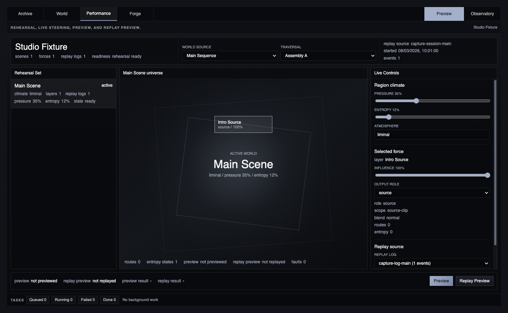
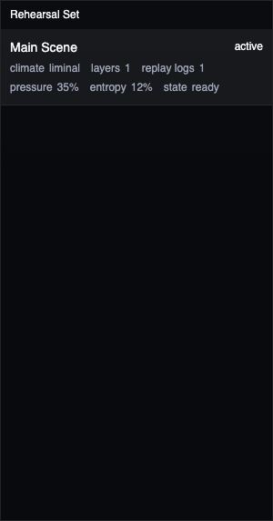
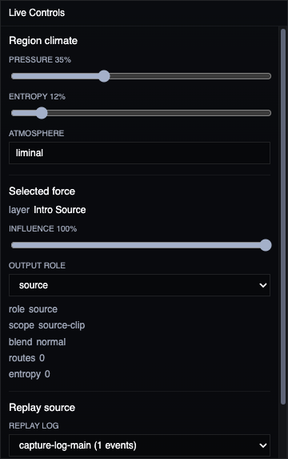
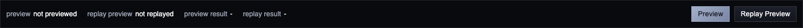
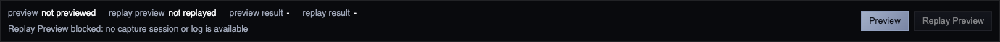

# Performance Space

Performance Space is the Studio rehearsal room. Use it when a composition already has a sequence and you want to steer the active world before committing to Forge output.

It brings the active scenes, forces, climate, entropy, preview state, and replay preview state into one console. It does not record a new capture. It lets you preview the current composition and apply an existing capture log when one is available.

## Choose The Active World

The top bar chooses the source sequence and traversal variant. These are the same composition targets used by World and Sequence, so changing them changes which universe Performance Space rehearses.

Use **World source** for the sequence and **Traversal** for the variant. The rehearsal console updates the scene list, central signal view, live controls, preview output path, and replay output path from that selection.

## Choose A Scene Or Region

The **Rehearsal Set** on the left lists the composition scenes. Each scene shows its climate, layer count, replay references, pressure, entropy, and readiness.

Select a scene to make it the active region. The central signal view moves to that region and exposes its forces as selectable layer controls.

## Steer Pressure, Entropy, And Influence

The **Live Controls** panel changes rehearsal-facing composition state:

- **Pressure** changes how forceful the selected region should feel.
- **Entropy** changes how unstable or drift-prone the selected region should feel.
- **Atmosphere** names the current climate.
- **Influence** changes the selected layer mix.
- **Output role** changes how the selected layer contributes to the preview.

These are normal project edits. They are saved through the same Studio project update path as World Space.

## Preview The Rehearsal

Use **Preview** in the output strip to bring the active sequence and variant into a rehearsal preview. The output strip shows whether the preview is idle, queued, building, ready, failed, or cancelled. When a preview completes, the last result path appears in the strip.

If Preview is blocked, the first blocking reason appears inline. Common reasons are an active variant with no clips, composition integrity issues, or another preview already running.

## Replay A Capture Log

Use **Replay Preview** when the project already has a capture log. Performance Space selects the latest capture session and matching log by default, and you can choose another replay log from Live Controls.

Replay Preview builds a preview with the selected capture session/log applied. It does not append new capture events and it does not arm recording.

When no capture log exists, Replay Preview stays blocked and the output strip explains why.

## Readiness And Blocked States

Readiness is shown in the header, scene list, central signal view, and output strip.

- **Rehearsal ready** means the active variant has clips and no composition integrity blockers.
- **Replay preview ready** additionally needs a selected capture log with events.
- **Blocked** means the action is unavailable until the inline reason is fixed.
- **Building preview** or **queued** means an existing preview or replay preview owns that output target.
- **Failed** means the last job for that output target ended with an error; read the output strip before retrying.

## Where To Go Next

Use **World** for deeper composition authoring, **Sequence** for clip assembly, and **Forge** for traversal artifacts, replay forge output, export profiles, and delivery recovery. Performance Space is for rehearsal and steering.
